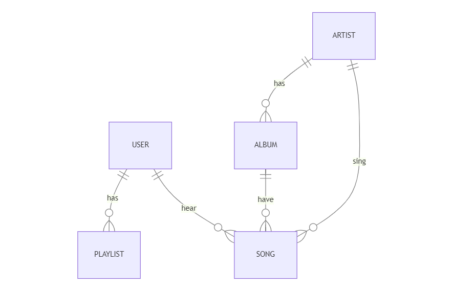

# Design Document

# MUSICARA
By
# Yayati Vaidya

Video overview: <https://youtu.be/2-GpRSh2Ds4>

## Scope

In this section you should answer the following questions:

* What is the purpose of your database?
  The purpose of the described database is to store and manage information related to a music streaming service, similar to Spotify. The database is designed to organize data about users, artists, albums, songs, playlists, and relationships between them.

* Which people, places, things, etc. are you including in the scope of your database?
  The database I provided as an example includes entities related to a music streaming service.

* Which people, places, things, etc. are *outside* the scope of your database?
  The provided database schema is designed specifically for managing data related to a music streaming service. As such, it includes entities relevant to the functionality of such a service.

## Functional Requirements

In this section you should answer the following questions:

* What should a user be able to do with your database?
  The functionality of the database is aligned with the purpose of managing a music streaming service. Users should be able to perform various actions and interactions within the system.

* What's beyond the scope of what a user should be able to do with your database?
  While the provided database schema and associated functionalities cover a broad range of features for a music streaming service, there are several aspects that might be considered beyond the immediate scope of what a user should be able to do with the database.

## Representation

### Entities

In this section you should answer the following questions:

* Which entities will you choose to represent in your database?
  1. User:
    Represents individuals who use the music streaming service.
  2. Artist:
    Represents musical artists or bands.
  3. Album:
    Represents music albums released by artists.
  4. Song:
    Represents individual songs.
  5. Playlist:
    Represents user-created playlists.

* What attributes will those entities have?
  1. User Entity:
     `id` (Primary Key)
     `username`
     `email`
     `password`
  2. Artist Entity:
     `id` (Primary Key)
     `name`
  3. Album Entity:
     `id` (Primary Key)
     `artist_id` (Foreign Key referencing Artist)
     `album_title`
     `release_date`
  4. Song Entity:
     `id` (Primary Key)
     `artist_id` (Foreign Key referencing Artist)
     `album_id`  (Foreign Key referencing Album)
     `user_id`   (Foreign Key referencing User)
     `song_title`
     `duration`
     `release_date`
  5. Playlist Entity:
    `id` (Primary Key)
    `user_id` (Foreign Key referencing User)
    `playlist_title`
    `description`

* Why did you choose the types you did?
The choice of entity types for the database is based on the typical structure and requirements of a music streaming service. Here's the rationale behind choosing each entity type:
  1. User:
    Represents the individuals using the music streaming service. Users are fundamental to personalization, allowing the service to tailor recommendations, playlists, and interactions based on their preferences.
  2. Artist:
    Represents musical artists or bands. Artists are essential for organizing and categorizing music. Users may want to explore content by their favorite artists, and artists play a key role in recommendations.
  3. Album:
    Represents music albums released by artists. Albums provide a way to group related songs together, and they contribute to the organization and presentation of the music catalog.
  4. Song:
    Represents individual songs. Songs are the core content of the music streaming service. They are associated with artists and albums, enabling users to discover, listen, and interact with specific tracks.
  5. Playlist:
    Represents user-created playlists. Playlists allow users to organize and curate their favorite songs, creating personalized collections that can be shared or enjoyed privately.
The chosen entity types and their relationships form a foundation for managing user interactions, content organization, and personalized experiences within the music streaming service. This schema aims to cover essential aspects of user engagement and content management in a music streaming platform.

* Why did you choose the constraints you did?
In the provided database schema, I didn't explicitly mention constraints, but constraints are an essential part of database design. Constraints ensure data integrity and enforce rules to maintain consistency. Here are some common constraints and why they are important in the context of the music streaming service database:
  1. Primary Key Constraints:
    Primary keys uniquely identify each record in a table. In the schema, primary keys (e.g., UserID, ArtistID, AlbumID, SongID, PlaylistID) ensure that each entity has a unique identifier. This uniqueness is crucial for accurate referencing and retrieval of data.
  2. Foreign Key Constraints:
    Foreign keys establish relationships between tables. For example, the AlbumID in the Song table is a foreign key referencing the primary key AlbumID in the Album table. This ensures referential integrity, meaning that a song cannot reference an album that doesn't exist.
  3. Data Types and Constraints:
    Data types are chosen to accurately represent the nature of the data (e.g., TEXT, INTEGER, DATE).
    Constraints, such as NOT NULL is used to enforce data integrity and business rules.
These constraints help ensure that the data stored in the database is accurate, consistent, and adheres to the defined rules. They contribute to the overall reliability and quality of the database.

### Relationships

In this section you should include your entity relationship diagram and describe the relationships between the entities in your database.

1. User and Playlist:
   Relationship Type: One-to-Many
   Description: Each user can create multiple playlists, but each playlist is created by only one user.
2. Artist and Album:
   Relationship Type: One-to-Many
   Description: Each artist can release multiple albums, but each album is released by only one artist.
3. Artist and Song:
   Relationship Type: One-to-Many
   Description: Each artist can create multiple songs, but each song is created by only one artist.
4. Album and Song:
   Relationship Type: One-to-Many
   Description: Each album can have multiple songs, but each song belongs to only one album.
5. User and Song:
   Relationship Type: One-to-Many
   Description: Each user can have multiple songs, but each song is associated with only one user.
These relationships help define how different entities in the database are connected and how data can be queried and retrieved based on these connections. For instance, a user can have playlists, like songs, follow artists, and these relationships enable a more comprehensive music streaming experience.

## Optimizations

In this section you should answer the following questions:

* Which optimizations (e.g., indexes, views) did you create? Why?
  Indexing the `primary key (user_id)` is a common optimization practice. It improves the efficiency of lookups based on user ID, which is often used in user authentication and other user-specific operations.
  If your application frequently searches or filters playlists based on their titles, creating an index on `playlist_title` can significantly speed up these operations.
  Similar to playlists, if there are frequent queries involving `song_title`, creating an index on SongTitle can enhance the performance of searches and filters.
  The index can improve the efficiency of queries that involve finding `playlist`s associated with a particular `user`. It can be beneficial for JOIN operations and filtering.
  If there are queries that involve finding artists followed by a user, creating an index on `artist_id` can optimize these operations.

## Limitations

In this section you should answer the following questions:

* What are the limitations of your design?
  1. Scalability:
    The schema may face challenges in handling a large number of users, songs, and interactions. As the user base and content grow, scalability considerations, such as database sharding or partitioning, may need to be addressed.
  2. Complexity of Queries:
    Complex queries involving multiple joins, especially for generating personalized recommendations, may impact performance. Consideration of indexing and optimization strategies is crucial.
  3. Security:
    The design does not explicitly address security aspects such as encryption, secure user authentication, or protection against common security threats. Security measures should be implemented at the application and infrastructure levels.
  4. Transaction Management:
    The schema does not include mechanisms for managing financial transactions or subscription details. For a commercial music streaming service, a separate system for transaction management and billing would be necessary.
  5. User Support and Communication:
    The schema does not include features for user support or communication channels. Customer support and communication functionalities would typically involve external systems or platforms.

* What might your database not be able to represent very well?
  1. Dynamic and Personalized Recommendations:
    Generating highly dynamic and personalized song recommendations for users based on real-time preferences, listening history, and contextual factors might be challenging. Advanced recommendation algorithms and dedicated systems may be necessary.
  2. Advanced User Analytics:
    Complex analytics and insights into user behavior, such as in-depth trend analysis, user engagement patterns, and advanced data mining, may be limited. Specialized analytics tools or systems could be required for more sophisticated analysis.
  3. Offline Mode and Download Management:
    The schema does not include features for managing offline mode or downloaded content. Implementing features related to content download, offline access, and download management may require additional considerations.
  4. Advanced User Profiles:
    The user profile information is relatively basic in the provided schema. Advanced user profiles with detailed preferences, user-generated content, and social interactions may need additional attributes or a dedicated user profile management system.
  5. Streaming Quality and Bitrate:
    The schema does not address features related to streaming quality, bitrate preferences, or adaptive streaming. Ensuring a high-quality streaming experience might involve additional considerations in a production system.
